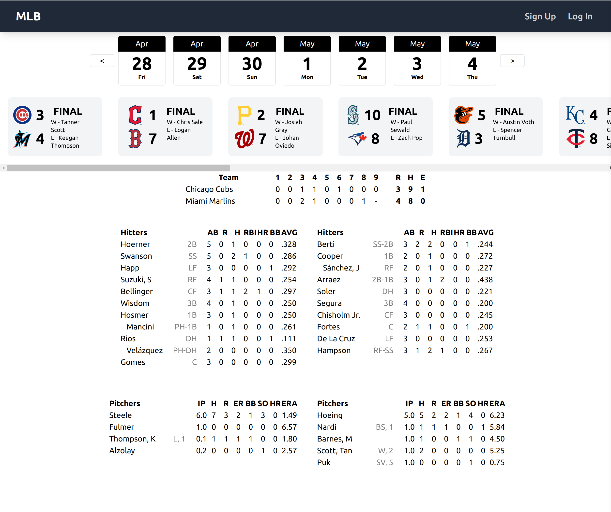
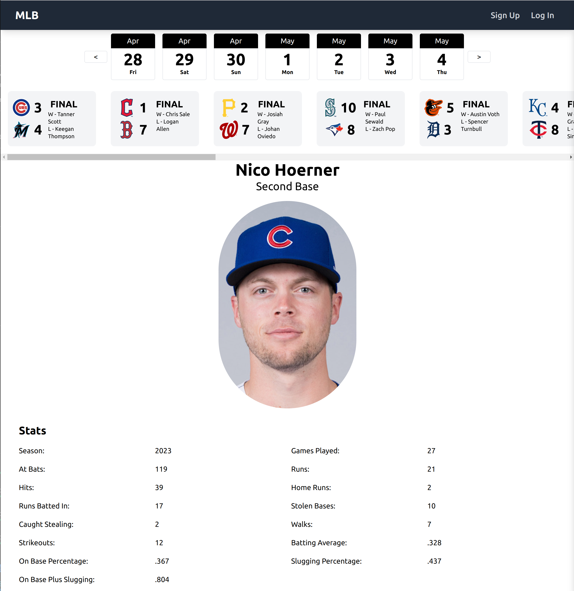
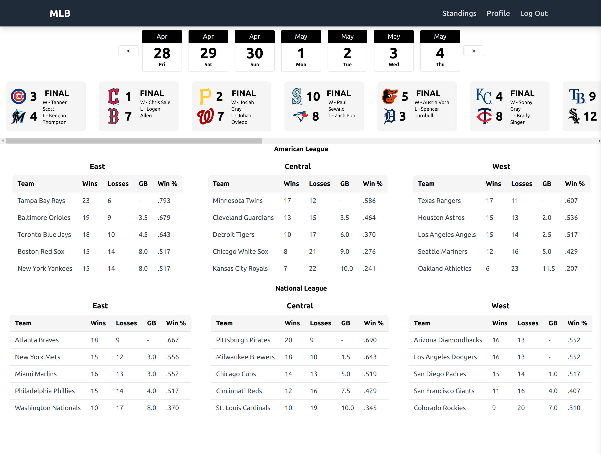

<h1> MLB Info </h1>
<h3> by: Jim Creel </h3>

<h3><a href='https://mlbinfo.herokuapp.com'> Link to MLB Info </a> </h3>

 

<h2> Project Description </h2>

 

 At the end of my software engineering immersive at General Assembly, I wanted to track my progress toward the goals I had set for myself. I was particularly interested in learning to anticipate how code would render on the screen in formats that can be problematic. Baseball standings, stats, and infographics fit the bill perfectly, and gave me a great opportunity to demonstrate some of the concepts we learned for MERN stack applications. 

The resulting MLB Info app presents real-time baseball information to users in a familiar but friendly way, using MLB's publicly available API and an express/MongoDB backend to serve user comments. 

 

<h2> Getting Started </h2>

I used <a href='https://www.figma.com/file/rNY1vkTY5Yu51Ga7rUl4s4/Untitled?node-id=0%3A1&t=uWCXiQ4j6XhjaeI4-1'>Figma to wireframe the project</a>, along with some hand sketches. 
Team logos are MLB's official logos, while the base and outs indicator in the ticker were drawn by me in GiMP. 

 

<h2> Installation Instructions </h2>
<ol>
    <li> Fork and clone the repo </li>
    <li> in the cloned directory, run npm i to install dependencies </li>
    <li> From separate terminals, run 'npm run frontend' and 'npm run backend'</li>
    <li> Navigate to localhost:XXXX , where 'XXXX' is the port indicated in the frontend terminal</li>
    <li> Users cannot see comments without being logged in. There is a sign-up link in the nav bar</li>
</ol>

 

<h2> Technology Used </h2>
<ul>
    <li> React.js </li>
    <li> Tailwind CSS </li>
    <li> Javascript </li>
    <li> Express.js </li>
    <li> MongoDB </li>
    <li> Mongoose ODM </li>
    <li> Node.js </li>
</ul>

<h2>Next Steps</h2>
Future development on the site includes the ability to set favorite teams and players, stat leaders, and notifications. 

